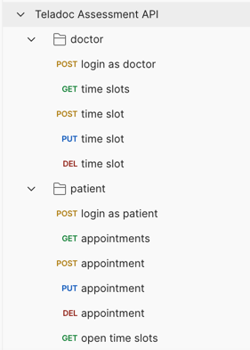

# Doctor Appointments API
API for booking doctors appointments by patients

## How to run project locally

**1. after cloning repo install all dependencies**
   > bundler install

**2. copy development secret key (it should be shared via some secret manager tool instead)**
   > cp config/master.key.template config/master.key

**3. migrate Data Base**
   > rails db:migrate

**4. substitute DB with default data**
   > rails db:seed --trace

**5. run the server**
   > rails s

**6. in addition, here is command how to run tests**
   > rspec spec

**0. moreover, there is `JSON` file with collection in root directory for exporting into Postman app**
   > cp docs/postman_collection.json /<export_directory>

### How to run project in Docker container

**1. build image**
   > docker build -t doctor-appointment-api .

**2. run image**
   > docker run -p 3000:3000 doctor-appointment-api

# Steps of implementation and developer notes

**1. Understand the Requirements:**
> - carefully read and understand the problem definition.
> - identify the core functionalities the API should provide: managing doctor availabilities, patient booking/editing appointments, and viewing availability.

**2. Select the Technology Stack:**
> - choose the programming language and framework.
>   - RoR, SQLite, Docker, JWT, Pundit, DRY-validation, Alba, Swagger, RSpec, FactoryBot

**3. Design Data Models:**
> - determine the data models required for this system.
> - create `Doctor` and `Patient` models inherited from `User` one via STI
>   - STI will be better than polymorphic relations due to presence the same fields in our case
> - create new `TimeSlot` model
>   - contains `start_time` and `end_time` fields for defining size of appointment in time
>     - first of all I decided to use Unix timestamp instead `date` format
>       - procs:
>         - easy to process
>         - less size in DB
>         - ideal to calculate and handle time difference
>       - cons:
>         - worse readability
>         - need Presenter layer to send data in response
>         - no ability to handle different time zones
>     - however after I have changed my mind as
>       - storing, handling, validation date type on DB layer has good performance as well
>       - `DRY-validation` contract works with that data type received from client perfectly
>         - in web applications, use a datetimepicker to select the date and time conveniently, converting values easily into the ISO 8601 format for API transmission
>         - it allows to accept and transmit date and time with the timezone to account for time differences between different locations
>       - finally, providing data in ISO 8601 format in responce is the best practice in building API
>   - it contains `day_of_week` enum for better rendering of doctors schedule on client side
>     - added as optional now
>     - can be useful for ability to set the same time slots for doctors on some day based on monthly schedule
>   - we store only created slots by doctors themselves, based on list of booked slot per each single day client will be able to render free slots for booking slots
>   - all validation logic (including not possibility to overlap visits) should be handled on client side and will be implemented on server side as well before storing 
>   - implement overlap validation as model validation that will bw working on DB layer as well
> - create `Appointment` model
>   - extend `TimeSlot` model with status field
>   - duplicate `start_time`, `end_time` from each time slot to its related appointment
>     - first of all to provide ability to handle and validate time overlaps in patient's schedule
>     - to provide better performance on index endpoint with ability to filter by doctor, desired date and time and statuses
>   - provide own `status` field with couple potential item for using the future
>   - duplicate `no_overlapping_time_slots` validation logic from `TimeSlot` model to ability avoiding overlaps in patients scheduling
>   - implement validation to forbid booking appointments on one doctors time slot for different patients
>   - implement validation to avoid booking appointments to time slots from past 
>   - after some discovering I have decided to remove duplicated `start_time` and `end_time` fields in `Appointment` model
>     - at least it reduces stored duplicated data in DB 
>     - change all validation queries in model using `joins` to get time values from related model and handle its values 
> - design and use `Service Object` to encapsulate and manage business logic in separate abstraction
>   - service objects represent a single system action such as adding a record to the database or sending an email
>   - service objects should contain no reference to anything related to HTTP, such as requests or parameters
> - implement `Query Object` on `show_open_slots` endpoint to handle complicated querying of records collection on index endpoint with extend filtering params and potentially ordering ones
> - final DB schema with relations is next (see screenshot below)
> - 

**4. API Endpoints:**
> - define the API endpoints based on the requirements.
> - ensure that the API follows RESTful principles (HTTP methods like GET, POST, PUT, DELETE, status codes, etc.).
> - first point is that all endpoint is divided to two groups for providing ability to implement and manage:
>   - booking and other CRUD operations for doctors and theirs availability slots (separated into `/doctor` path and module)
>   - booking and other CRUD operations for patient and theirs appointments (separated into `/patient` path and module)
> - create CRUD endpoints for ability to manage available slot in doctors schedule
> - use `Alba` gem for serialization
>   - potentially we can convert oll keys to `lowerCamelCase` adding one command in base serializer
> - add ability to filter or doctors time slots or patients appointments that are started before some date (current time by default) on all `Index` endpoints

**5. Authentication and Authorization:**
> - Implement user authentication to ensure only authorized users can book or modify appointments.
> - use `JWT` gem to authentication users
> - create simple `login` endpoint to authenticate current user by JWT
> - use `Pundit` gem to authorise users permissions

**6. Validation and Error Handling:**
> - add validation for incoming data to prevent invalid bookings or data corruption.
>   - use `Dry-validation` gem
>     - add addition DRY rules for cases when slots time data is not valid
> - implement robust error handling to provide meaningful error messages through whole API.
>   - we are able not pass error message to response body if we don't want to show any internal errors in clients

**7. Documentation:**
> - create this README.md file that explains how to run and use the service.
> - added developer notes that were written during implementation
> - include Postman collection into project for sharing with other team members
>   - here is short description about all created endpoints
>   - 
>   - first of all there is one simple `login` endpoint to authorize current user 
>   - second there is group CRUD endpoints on `<server>/doctor/time_slots` path to provide doctors ability to manage theirs availability slots in schedule
>     - `GET /doctor/time_slots` - returns all available slots created by current doctor (returns items with all statuses)
>       - supports `started_from` parameter to filter records with `start_time` older than desired date and time
>     - `POST /doctor/time_slots` - creates new slot using JSON data in payload
>     - `PUT /doctor/time_slots/:id` - allow to update any record from doctor's created items scope
>     - `DELETE /doctor/time_slots/:id` - removes record created by current doctor
>   - next we have second group of CRUD endpoints, related to patient's actions on `<server>/patient/appointments` path
>     - `GET /patient/appointments` - returns all appointments created by current patient
>       - supports `started_from` parameter to filter records with `start_time` older than desired date and time
>     - `POST /patient/appointments` - creates new appointment using JSON data in payload
>     - `PUT /patient/appointments/:id` - allow to update any record from patient's created items scope
>     - `DELETE /patient/appointments/:id` - removes record created by current patient
>     - besides, there is one custom endpoint with `/time_slots` in path to get all open and not booked doctors availabilities
>       - `GET /patient/time_slots/open` - return list of only open time slots created by different doctors
>         - supports `started_from` parameter to filter records with `start_time` older than desired date and time
>         - supports `doctor_id` parameter to filter items created by one doctor
>     - you can export that JSON collection and try to send requests to any endpoint from Postman
>       - don't forget to send `/login` before to authenticate doctor user or patient one

**8. Testing:**
> - write couple model unit tests to ensure the reliability of your code
> - cover all endpoint with own integration test using Swagger framework and generate very useful and helpful documentation
>   - 
>   - visit `<server>/api-docs` you can see automatically generated API documentation like on screenshot above

**9. Deployment:**
> - now API is setup to run directly in local environment only
> - implement simple Docker file that can build and run in one container the app with DB

**10. Future Improvements:**
> - consider additional features or improvements, such as notifications, email confirmations, or an admin interface.
> - implement cron job to mark all TimeSlot's and Appointment `end_time of those is in the past`
> - implement some blocker on business logic layer
>   - for instance, no ability to remove time slot by doctor if there is related booked appointment from patient
> - write unit and swagger tests
> - configure Docker
> - improve DB indexes
>   - for example, we can create new index for faster receiving start & end times by slots IDs
>   - however, it may increase index size in memory due to duplications data from those timestamps fields
>   - `add_index :time_slots, [:start_time, :end_time]`
> - write more unit tests to ensure the reliability of your code
> - pay attention and implement good validation how to work with models that have start and end times in the past
>   - for instance if user can remove appointment that is started they must be allowed to update status of its time slot, etc
